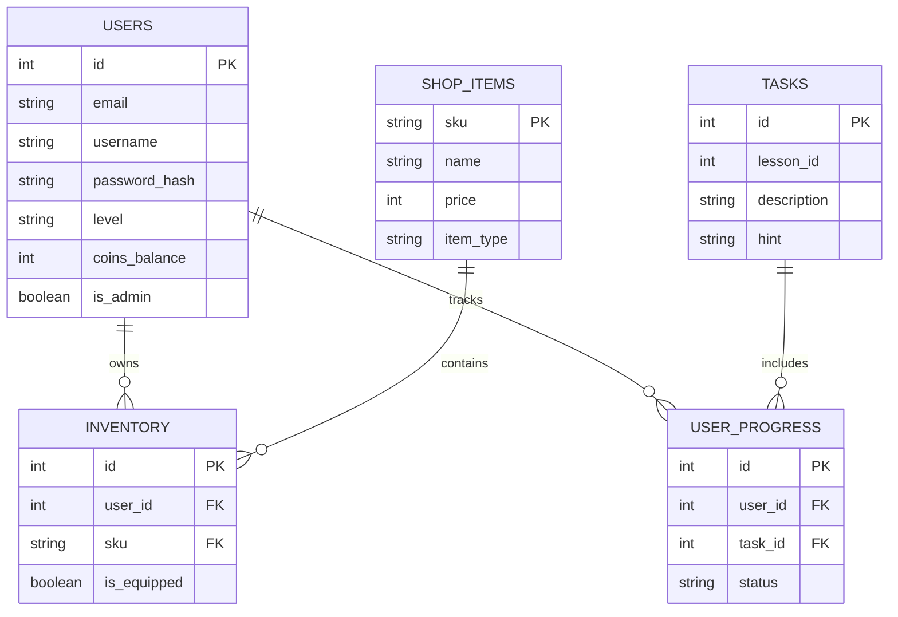

# Таблица: USERS (Пользователи)

**Хранит основные данные учеников и администраторов, а также их экономический баланс.**

| Поле(Атрибут) | Тип данных | Описание и Связи |
| --- | --- | --- |
| id | Integer | (Primer Key) Уникальный идентификатор пользователя |
| email | String | Email для авторизации (уникальное поле) |
| username | String | Имя/логин ученика на платформе |
| password_hash | String | Зашифрованный пароль |
| level | String | Текущий уровень знаний (указывается при регистрации) |
| coins_balance | Integer | Баланс виртуальных монет (обновляется при бонусах и покупках) |
| is_admin | Boolean | Флаг администратора (доступ к /admin панелям) |

# Таблица: TASKS (Задания и тесты)

**Хранит контент учебных этапов для проверки кода или тестов.**

| Поле(Атрибут) | Тип данных | Описание и Связи |
| --- | --- | --- |
| id | Integer | (Primary Key) Уникальный ID задачи |
| lesson_id | Integer | Идентификатор урока, к которому относится задача |
| description | String | Текст задания |
| hint | String | Статичная подсказка, если ИИ-модель недоступна |

# Таблица: SHOP_ITEMS (Каталог магазина)

**Хранит информацию о всех доступных скинах и товарах системы.**

| Поле(Атрибут) | Тип данных | Описание и Связи |
| --- | --- | --- |
| sku | String | (Primary Key) Артикул/уникальный строковый код товара |
| name | String | Название предмета (например, "Шляпа волшебника") |
| price | Integer | Стоимость предмета в монетах |
| item_type | String | Категория товара (скин, аватарка, рамка) |

# Таблица: INVENTORY (Инвентарь покупок)

**Связующая таблица (Многие-ко-Многим). Показывает, какие предметы купил конкретный пользователь и надеты ли они на него.**

| Поле(Атрибут) | Тип данных | Описание и Связи |
| --- | --- | --- |
| id | Integer | (Primary Key) Уникальный ID записи |
| user_id | Integer | (Foreign Key) Ссылка на id из таблицы USERS |
| sku | String | (Foreign Key) Ссылка на sku из таблицы SHOP_ITEMS |
| is_equipped | Boolean | Флаг: надет ли предмет сейчас на персонажа (true/false) |

# Таблица: USER_PROGRESS (Прогресс прохождения)

**Связующая таблица, отслеживающая, какие задания уже решил пользователь, чтобы не выдавать их повторно.**

| Поле(Атрибут) | Тип данных | Описание и Связи |
| --- | --- | --- |
| id | Integer | (Primary Key) Уникальный ID записи |
| user_id | Integer | (Foreign Key) Ссылка на id из таблицы USERS |
| sku | String | (Foreign Key) Ссылка на id из таблицы TASKS |
| is_equipped | Boolean | Текущий статус (например: completed, pending, failed) |

