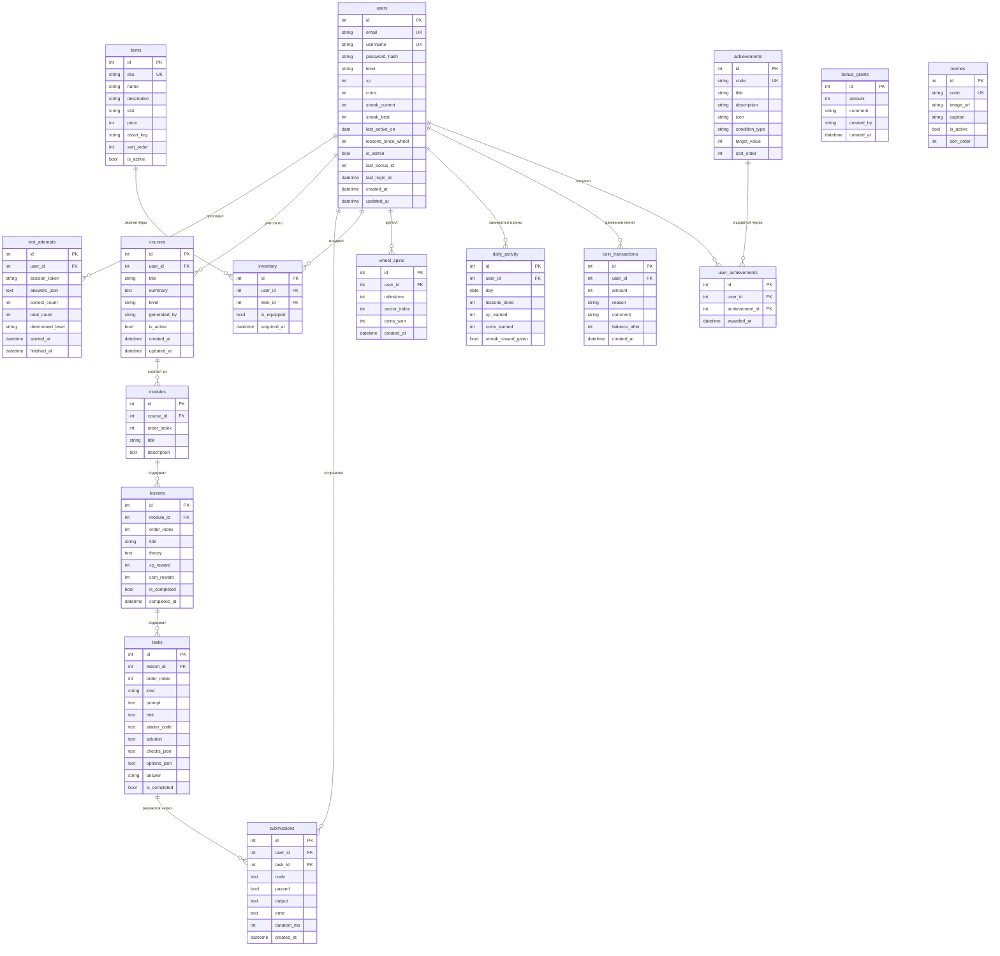

# Схема базы данных «CodeHogwarts»

**16 сущностей**, из них **11 представляют объекты реального мира** и 5 — служебные и связующие.

> Документ **генерируется** из моделей приложения скриптом `собрать-схему.py`. Править его руками не нужно: при изменении моделей он пересобирается и не может разойтись с кодом.

## ERD

### Объекты реального мира (11)

| Таблица | Что моделирует | Пояснение |
|---|---|---|
| `achievements` | Медаль | Награда за поведение: тип условия и порог. |
| `courses` | Курс | Персональная программа обучения, собранная под уровень ученика. |
| `items` | Предмет магазина | Товар: одежда, скин, транспорт, дом. |
| `lessons` | Урок | Занятие: теория и набор заданий. |
| `memes` | Мем | Картинка, которую показывают после пройденного урока. |
| `modules` | Модуль | Раздел курса — несколько уроков на одну тему. |
| `submissions` | Решение | Попытка сдачи: что человек написал, прошло ли и что вернулось. |
| `tasks` | Задание | Конкретный вопрос или задача внутри урока. |
| `test_attempts` | Попытка диагностики | Прохождение вводного теста: ответы, счёт, определённый уровень. У гостя поле user_id пустое, пока он не зарегистрируется. |
| `users` | Ученик | Человек, который учится. Профиль, игровой баланс и состояние серии. |
| `wheel_spins` | Вращение колеса | Событие с призом. |

### Служебные и связующие (5)

| Таблица | Что моделирует | Пояснение |
|---|---|---|
| `bonus_grants` | Массовое начисление | Служебная. Бонус адресован сразу всем, поэтому внешнего ключа на пользователя намеренно нет. |
| `coin_transactions` | Движение монет | Служебная. Журнал начислений и трат — источник истины по балансу. |
| `daily_activity` | День занятий | Служебная. На ней держится трекер серии и дневной лимит наград. |
| `inventory` | Инвентарь | Связующая: «пользователь ↔ предмет», многие-ко-многим. |
| `user_achievements` | Полученные медали | Связующая: «пользователь ↔ медаль», многие-ко-многим. |

## Поля таблиц

Обозначения: **PK** — первичный ключ, **UK** — уникальное значение, **FK** — внешний ключ, ссылка на другую таблицу.

### `achievements` — Медаль

Награда за поведение: тип условия и порог.

| Поле | Тип | Ключ | Обязательное | Ссылка |
|---|---|---|---|---|
| `id` | int | PK | да | — |
| `code` | string | UK | да | — |
| `title` | string | — | да | — |
| `description` | string | — | да | — |
| `icon` | string | — | да | — |
| `condition_type` | string | — | да | — |
| `target_value` | int | — | да | — |
| `sort_order` | int | — | да | — |

### `bonus_grants` — Массовое начисление

Служебная. Бонус адресован сразу всем, поэтому внешнего ключа на пользователя намеренно нет.

| Поле | Тип | Ключ | Обязательное | Ссылка |
|---|---|---|---|---|
| `id` | int | PK | да | — |
| `amount` | int | — | да | — |
| `comment` | string | — | да | — |
| `created_by` | string | — | да | — |
| `created_at` | datetime | — | да | — |

### `coin_transactions` — Движение монет

Служебная. Журнал начислений и трат — источник истины по балансу.

| Поле | Тип | Ключ | Обязательное | Ссылка |
|---|---|---|---|---|
| `id` | int | PK | да | — |
| `user_id` | int | FK | да | → `users.id` |
| `amount` | int | — | да | — |
| `reason` | string | — | да | — |
| `comment` | string | — | да | — |
| `balance_after` | int | — | да | — |
| `created_at` | datetime | — | да | — |

### `courses` — Курс

Персональная программа обучения, собранная под уровень ученика.

| Поле | Тип | Ключ | Обязательное | Ссылка |
|---|---|---|---|---|
| `id` | int | PK | да | — |
| `user_id` | int | FK | да | → `users.id` |
| `title` | string | — | да | — |
| `summary` | text | — | да | — |
| `level` | string | — | да | — |
| `generated_by` | string | — | да | — |
| `is_active` | bool | — | да | — |
| `created_at` | datetime | — | да | — |
| `updated_at` | datetime | — | да | — |

### `daily_activity` — День занятий

Служебная. На ней держится трекер серии и дневной лимит наград.

| Поле | Тип | Ключ | Обязательное | Ссылка |
|---|---|---|---|---|
| `id` | int | PK | да | — |
| `user_id` | int | FK | да | → `users.id` |
| `day` | date | — | да | — |
| `lessons_done` | int | — | да | — |
| `xp_earned` | int | — | да | — |
| `coins_earned` | int | — | да | — |
| `streak_reward_given` | bool | — | да | — |

- **UNIQUE** (`user_id`, `day`) — сочетание не может повториться.

### `inventory` — Инвентарь

Связующая: «пользователь ↔ предмет», многие-ко-многим.

| Поле | Тип | Ключ | Обязательное | Ссылка |
|---|---|---|---|---|
| `id` | int | PK | да | — |
| `user_id` | int | FK | да | → `users.id` |
| `item_id` | int | FK | да | → `items.id` |
| `is_equipped` | bool | — | да | — |
| `acquired_at` | datetime | — | да | — |

- **UNIQUE** (`user_id`, `item_id`) — сочетание не может повториться.

### `items` — Предмет магазина

Товар: одежда, скин, транспорт, дом.

| Поле | Тип | Ключ | Обязательное | Ссылка |
|---|---|---|---|---|
| `id` | int | PK | да | — |
| `sku` | string | UK | да | — |
| `name` | string | — | да | — |
| `description` | string | — | да | — |
| `slot` | string | — | да | — |
| `price` | int | — | да | — |
| `asset_key` | string | — | да | — |
| `sort_order` | int | — | да | — |
| `is_active` | bool | — | да | — |

- **CHECK** — `price >= 0`.

### `lessons` — Урок

Занятие: теория и набор заданий.

| Поле | Тип | Ключ | Обязательное | Ссылка |
|---|---|---|---|---|
| `id` | int | PK | да | — |
| `module_id` | int | FK | да | → `modules.id` |
| `order_index` | int | — | да | — |
| `title` | string | — | да | — |
| `theory` | text | — | да | — |
| `xp_reward` | int | — | да | — |
| `coin_reward` | int | — | да | — |
| `is_completed` | bool | — | да | — |
| `completed_at` | datetime | — | нет | — |

### `memes` — Мем

Картинка, которую показывают после пройденного урока.

| Поле | Тип | Ключ | Обязательное | Ссылка |
|---|---|---|---|---|
| `id` | int | PK | да | — |
| `code` | string | UK | да | — |
| `image_url` | string | — | да | — |
| `caption` | string | — | да | — |
| `is_active` | bool | — | да | — |
| `sort_order` | int | — | да | — |

### `modules` — Модуль

Раздел курса — несколько уроков на одну тему.

| Поле | Тип | Ключ | Обязательное | Ссылка |
|---|---|---|---|---|
| `id` | int | PK | да | — |
| `course_id` | int | FK | да | → `courses.id` |
| `order_index` | int | — | да | — |
| `title` | string | — | да | — |
| `description` | text | — | да | — |

### `submissions` — Решение

Попытка сдачи: что человек написал, прошло ли и что вернулось.

| Поле | Тип | Ключ | Обязательное | Ссылка |
|---|---|---|---|---|
| `id` | int | PK | да | — |
| `user_id` | int | FK | да | → `users.id` |
| `task_id` | int | FK | да | → `tasks.id` |
| `code` | text | — | да | — |
| `passed` | bool | — | да | — |
| `output` | text | — | да | — |
| `error` | text | — | да | — |
| `duration_ms` | int | — | да | — |
| `created_at` | datetime | — | да | — |

### `tasks` — Задание

Конкретный вопрос или задача внутри урока.

| Поле | Тип | Ключ | Обязательное | Ссылка |
|---|---|---|---|---|
| `id` | int | PK | да | — |
| `lesson_id` | int | FK | да | → `lessons.id` |
| `order_index` | int | — | да | — |
| `kind` | string | — | да | — |
| `prompt` | text | — | да | — |
| `hint` | text | — | да | — |
| `starter_code` | text | — | да | — |
| `solution` | text | — | да | — |
| `checks_json` | text | — | да | — |
| `options_json` | text | — | да | — |
| `answer` | string | — | да | — |
| `is_completed` | bool | — | да | — |

- **UNIQUE** (`lesson_id`, `order_index`) — сочетание не может повториться.

### `test_attempts` — Попытка диагностики

Прохождение вводного теста: ответы, счёт, определённый уровень. У гостя поле user_id пустое, пока он не зарегистрируется.

| Поле | Тип | Ключ | Обязательное | Ссылка |
|---|---|---|---|---|
| `id` | int | PK | да | — |
| `user_id` | int | FK | нет | → `users.id` |
| `session_token` | string | — | да | — |
| `answers_json` | text | — | да | — |
| `correct_count` | int | — | да | — |
| `total_count` | int | — | да | — |
| `determined_level` | string | — | нет | — |
| `started_at` | datetime | — | да | — |
| `finished_at` | datetime | — | нет | — |

### `user_achievements` — Полученные медали

Связующая: «пользователь ↔ медаль», многие-ко-многим.

| Поле | Тип | Ключ | Обязательное | Ссылка |
|---|---|---|---|---|
| `id` | int | PK | да | — |
| `user_id` | int | FK | да | → `users.id` |
| `achievement_id` | int | FK | да | → `achievements.id` |
| `awarded_at` | datetime | — | да | — |

- **UNIQUE** (`user_id`, `achievement_id`) — сочетание не может повториться.

### `users` — Ученик

Человек, который учится. Профиль, игровой баланс и состояние серии.

| Поле | Тип | Ключ | Обязательное | Ссылка |
|---|---|---|---|---|
| `id` | int | PK | да | — |
| `email` | string | UK | да | — |
| `username` | string | UK | да | — |
| `password_hash` | string | — | да | — |
| `level` | string | — | да | — |
| `xp` | int | — | да | — |
| `coins` | int | — | да | — |
| `streak_current` | int | — | да | — |
| `streak_best` | int | — | да | — |
| `last_active_on` | date | — | нет | — |
| `lessons_since_wheel` | int | — | да | — |
| `is_admin` | bool | — | да | — |
| `last_bonus_id` | int | — | да | — |
| `last_login_at` | datetime | — | нет | — |
| `created_at` | datetime | — | да | — |
| `updated_at` | datetime | — | да | — |

### `wheel_spins` — Вращение колеса

Событие с призом.

| Поле | Тип | Ключ | Обязательное | Ссылка |
|---|---|---|---|---|
| `id` | int | PK | да | — |
| `user_id` | int | FK | да | → `users.id` |
| `milestone` | int | — | да | — |
| `sector_index` | int | — | да | — |
| `coins_won` | int | — | да | — |
| `created_at` | datetime | — | да | — |

- **UNIQUE** (`user_id`, `milestone`) — сочетание не может повториться. 

