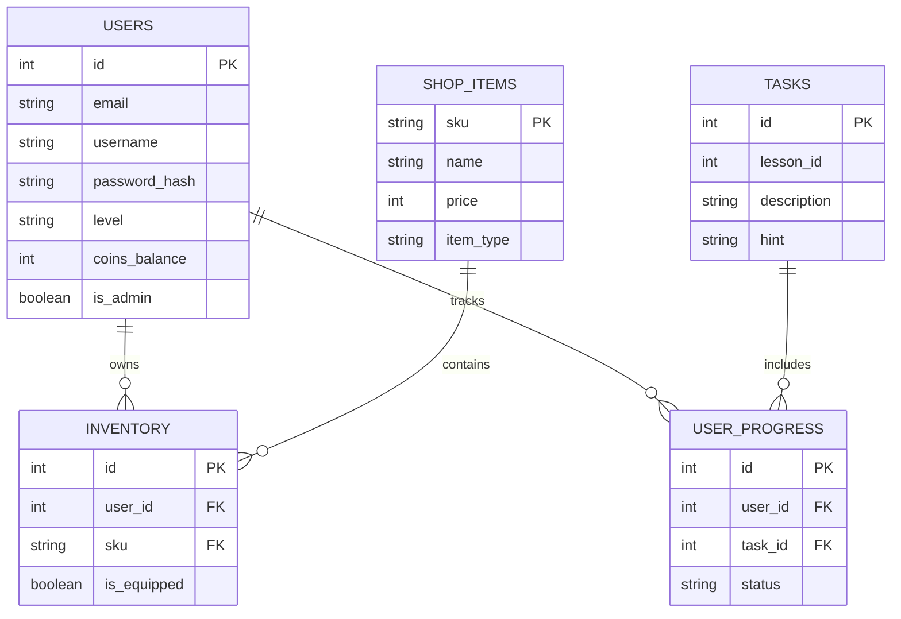

```mermaid
erDiagram
    USERS ||--o{ INVENTORY : owns
    SHOP_ITEMS ||--o{ INVENTORY : contains
    USERS ||--o{ USER_PROGRESS : tracks
    TASKS ||--o{ USER_PROGRESS : includes

    USERS {
        int id PK
        string email
        string username
        string password_hash
        string level
        int coins_balance
        boolean is_admin
    }

    TASKS {
        int id PK
        int lesson_id
        string description
        string hint
    }

    SHOP_ITEMS {
        string sku PK
        string name
        int price
        string item_type
    }

    INVENTORY {
        int id PK
        int user_id FK
        string sku FK
        boolean is_equipped
    }

    USER_PROGRESS {
        int id PK
        int user_id FK
        int task_id FK
        string status
    }
```
